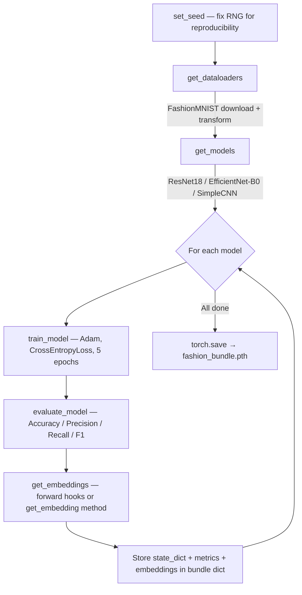
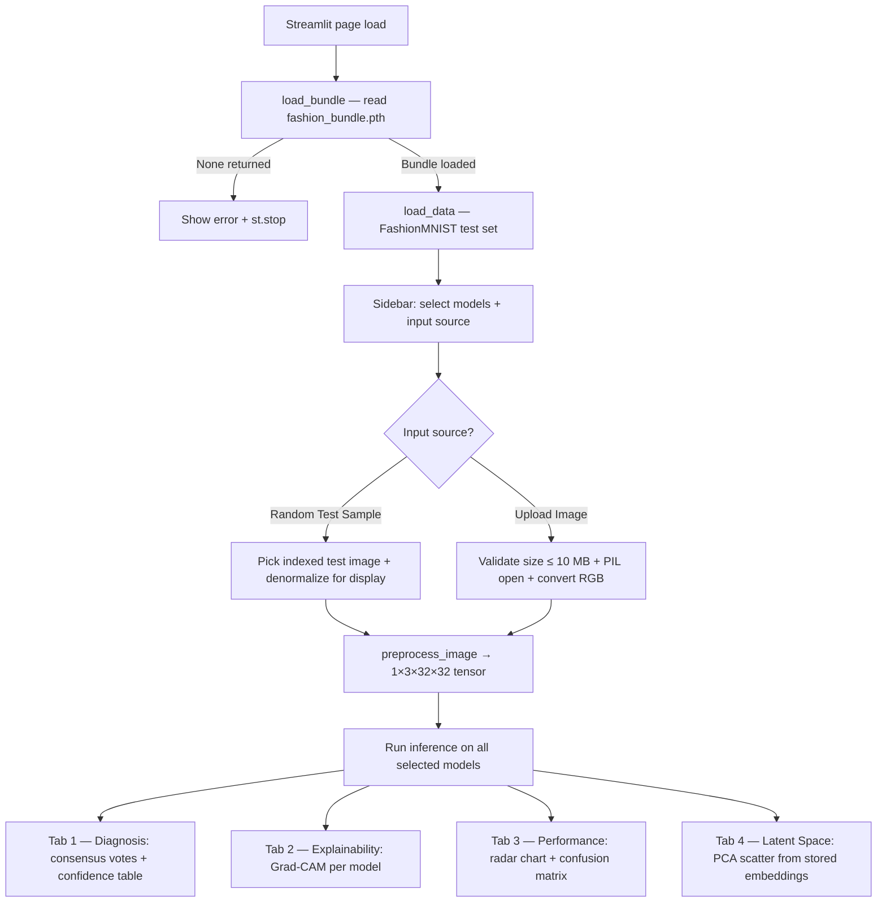

# Fashion Neural Lab 🔬

[](https://streamlit.io)


A comparative deep learning laboratory that trains three neural network architectures on [FashionMNIST](https://github.com/zalandoresearch/fashion-mnist), evaluates their performance, and serves an interactive Streamlit dashboard for side-by-side model analysis including Grad-CAM explainability, performance benchmarking, and latent-space visualization.

---

## Table of Contents

1. [Project Overview](#1-project-overview)
2. [Architecture Overview](#2-architecture-overview)
3. [System Flow](#3-system-flow)
4. [Data Model — Bundle Structure](#4-data-model--bundle-structure)
5. [Core Modules Breakdown](#5-core-modules-breakdown)
6. [Security & Input Validation](#6-security--input-validation)
7. [Setup & Installation](#7-setup--installation)
8. [Quickstart](#8-quickstart)
9. [Running the Application](#9-running-the-application)
10. [Testing](#10-testing)
11. [Limitations](#11-limitations)
12. [Future Improvements](#12-future-improvements)

---

## 1. Project Overview

Fashion Neural Lab trains and compares three architectures on the 10-class FashionMNIST dataset:

| Model | Origin | Final Layer Modification |
|---|---|---|
| **ResNet18** | `torchvision.models.resnet18` (ImageNet-pretrained) | `fc` → `Linear(512, 10)` |
| **EfficientNet-B0** | `torchvision.models.efficientnet_b0` (ImageNet-pretrained) | `classifier[1]` → `Linear(1280, 10)` |
| **SimpleCNN** | Custom 3-layer CNN defined in-project | `Linear(1024, 10)` |

**Key capabilities** (all traceable to code):

- **Multi-model consensus** — Feed a single image to all selected models, aggregate their votes, and display per-model confidence.
- **Grad-CAM explainability** — Visualize which spatial regions each architecture attends to when classifying.
- **Performance radar charts** — Compare Accuracy, Precision, Recall, and F1 across models on a polar plot.
- **Interactive confusion matrices** — Computed on-the-fly from stored embeddings and classifier heads.
- **Latent-space PCA** — Project the 10 000-image test-set embeddings into 2D via PCA and color by class.

**FashionMNIST classes:**

`T-shirt/top` · `Trouser` · `Pullover` · `Dress` · `Coat` · `Sandal` · `Shirt` · `Sneaker` · `Bag` · `Ankle boot`

---

## 2. Architecture Overview

The system consists of two entrypoints and a single shared artifact:

```
┌──────────────────────────────┐
│         train.py             │  Offline pipeline
│  Data → Train → Eval → Embed│
│  → Save fashion_bundle.pth  │
└──────────────┬───────────────┘
               │
        fashion_bundle.pth
               │
┌──────────────▼───────────────┐
│           app.py             │  Streamlit dashboard
│  Load bundle → Reconstruct  │
│  models → Serve 4-tab UI    │
└──────────────────────────────┘
```

| Component | File | Role |
|---|---|---|
| Training pipeline | `train.py` | Downloads FashionMNIST, trains 3 models, evaluates metrics, extracts embeddings, saves bundle |
| Dashboard | `app.py` | Loads bundle, reconstructs architectures, serves interactive comparison UI |
| Bundle | `fashion_bundle.pth` | Serialized dict containing state dicts, metrics, and embedding indices |
| Tests | `tests/` | 24 pytest-based unit and integration tests with stub fixtures |

`app.py` does **not** import `train.py`. It redefines `SimpleCNN` locally to avoid executing training-side code at import time. Architecture parity between the two files is enforced by integration tests.

---

## 3. System Flow

### Training pipeline (`train.py`)



### Dashboard pipeline (`app.py`)



### Preprocessing transform (shared)

Both `train.py` and `app.py` apply the identical transform pipeline:

```
Resize(32×32) → Grayscale(3 channels) → ToTensor → Normalize(ImageNet μ/σ)
```

---

## 4. Data Model — Bundle Structure

`fashion_bundle.pth` is a Python dict saved with `torch.save`. Its schema:

```python
{
    "models": {
        "ResNet18":        OrderedDict,   # model.state_dict()
        "EfficientNet-B0": OrderedDict,
        "SimpleCNN":       OrderedDict,
    },
    "metrics": {
        "ResNet18":        {"Accuracy": float, "Precision": float, "Recall": float, "F1": float},
        "EfficientNet-B0": { ... },
        "SimpleCNN":       { ... },
    },
    "search_index": {
        "ResNet18": {
            "vectors": Tensor,   # shape (N, D) — embeddings
            "labels":  Tensor,   # shape (N,)   — ground-truth class indices
            "paths":   list,     # list of int  — dataset indices
        },
        "EfficientNet-B0": { ... },
        "SimpleCNN":       { ... },
    },
}
```

The bundle is loaded with `weights_only=True` in `app.py`.

---

## 5. Core Modules Breakdown

### `train.py`

| Function | Purpose | Input | Output |
|---|---|---|---|
| `set_seed(seed)` | Fix Python, PyTorch, and CUDA RNG seeds; set cuDNN deterministic mode | `int` (default 42) | — |
| `get_dataloaders()` | Download FashionMNIST, apply transform, wrap in DataLoaders (batch 64) | — | `(train_loader, test_loader, test_data)` |
| `get_models()` | Instantiate ResNet18 (`weights='DEFAULT'`), EfficientNet-B0 (`weights='DEFAULT'`), SimpleCNN; replace final layers for 10 classes | — | `dict[str, nn.Module]` |
| `train_model(model, train_loader, epochs)` | Adam optimizer (lr=0.001), CrossEntropyLoss, per-batch validation guards (rank, shape, type) | model, DataLoader, int | trained `nn.Module` |
| `evaluate_model(model, test_loader)` | Inference pass → sklearn accuracy, weighted precision/recall/F1 | model, DataLoader | `dict` with 4 metric keys |
| `get_embeddings(model, loader, model_name)` | Extract latent representations. SimpleCNN uses `get_embedding()`. ResNet18/EfficientNet-B0 use a forward hook on `avgpool` | model, DataLoader, str | `(Tensor, Tensor, list)` |

### `app.py`

| Function | Purpose | Input | Output |
|---|---|---|---|
| `load_bundle()` | Read `fashion_bundle.pth` with `weights_only=True`; return `None` on missing/corrupt file; set `BUNDLE_LOAD_ERROR` global | — | `dict` or `None` |
| `get_model_architecture(model_name)` | Reconstruct architecture without weights; raise `ValueError` for unknown names | `str` | `nn.Module` |
| `load_active_models(selected, bundle_models)` | Load state dicts into reconstructed architectures, move to device, set eval mode; raise `KeyError` if model absent from bundle | `list[str]`, `dict` | `dict[str, nn.Module]` |
| `preprocess_image(image)` | Apply shared `IMAGE_TRANSFORM`, unsqueeze batch dim, move to device | `PIL.Image` | `Tensor (1,3,32,32)` |
| `get_gradcam(model, model_name, input_tensor, target_class_idx)` | Build `GradCAM` with architecture-specific target layer; raise `ValueError` for unknown names | model, str, Tensor, int | `np.ndarray (H,W)` |

### `SimpleCNN` (defined in both files)

```
Conv2d(3→32, 3×3) → ReLU → MaxPool2d(2)
Conv2d(32→64, 3×3) → ReLU → MaxPool2d(2)
Conv2d(64→64, 3×3) → ReLU → MaxPool2d(2)
Flatten(64×4×4 = 1024)
Linear(1024 → 10)
```

`get_embedding()` returns the 1024-d flattened feature vector before the classifier.

---

## 6. Security & Input Validation

The following protections are implemented in code. No additional security layers exist.

| Protection | Location | Behavior |
|---|---|---|
| Bundle load safety | `app.py` `load_bundle()` | `torch.load(weights_only=True)` — rejects arbitrary pickle payloads |
| Missing/corrupt bundle | `app.py` `load_bundle()` | Returns `None`; dashboard shows error and calls `st.stop()` |
| Unknown model name | `app.py` `get_model_architecture()`, `get_gradcam()` | Raises `ValueError` |
| Missing model key in bundle | `app.py` `load_active_models()` | Raises `KeyError` |
| Upload file size limit | `app.py` upload handler | Rejects files > 10 MB |
| Invalid upload format | `app.py` upload handler | Catches `UnidentifiedImageError` and `OSError` |
| Training batch validation | `train.py` `train_model()` | Validates tensor rank (4 for images, 1 for labels), batch-size match, and type (catches `TypeError`/`AttributeError` from non-tensor data) |
| Unsupported embedding model | `train.py` `get_embeddings()` | Raises `ValueError` for names not in `{ResNet18, EfficientNet-B0, SimpleCNN}` |

**Not implemented:** rate limiting, authentication, CSRF protection, output sanitization. The dashboard is designed for local or trusted-network use.

---

## 7. Setup & Installation

### Prerequisites

- Python 3.10+
- Internet connection on first run (to download pretrained ResNet18 / EfficientNet-B0 backbone weights and the FashionMNIST dataset)
- CUDA GPU optional (the code auto-detects via `torch.cuda.is_available()` and falls back to CPU)

### Create virtual environment and install

```bash
python -m venv .venv
```

Activate:

```bash
# Linux / macOS
source .venv/bin/activate

# Windows (PowerShell)
.\.venv\Scripts\Activate.ps1
```

Install dependencies:

```bash
pip install -r requirements.txt
```

Dependencies defined in `requirements.txt`:

| Package | Used by |
|---|---|
| `torch`, `torchvision` | Model training, pretrained backbones, transforms, FashionMNIST |
| `streamlit` | Dashboard UI |
| `grad-cam` | Grad-CAM heatmap generation |
| `scikit-learn` | Accuracy, precision, recall, F1, PCA, confusion matrix |
| `plotly` | Radar charts, confusion matrix heatmaps, PCA scatter |
| `pandas` | DataFrame display in Streamlit tables |
| `opencv-python-headless` | Grad-CAM overlay resizing |
| `numpy`, `pillow` | Array/image manipulation |
| `tqdm` | Training progress bars |

---

## 8. Quickstart

```bash
# 1. Clone and enter
git clone https://github.com/pypi-ahmad/Fashion-Class-Classification.git
cd Fashion-Class-Classification

# 2. Virtual environment
python -m venv .venv
.\.venv\Scripts\Activate.ps1   # or source .venv/bin/activate

# 3. Install
pip install -r requirements.txt

# 4. Train (downloads data + pretrained weights on first run)
python train.py

# 5. Launch dashboard
streamlit run app.py

# 6. (Optional) Run tests
pip install pytest
python -m pytest -q
```

---

## 9. Running the Application

### Training (`train.py`)

```bash
python train.py
```

Execution:
1. Seeds RNG (`random`, `torch`, CUDA) with seed 42.
2. Downloads FashionMNIST to `./data/` (60 000 train / 10 000 test).
3. For each of the 3 models: trains 5 epochs (Adam, lr=0.001, batch 64), evaluates, extracts embeddings.
4. Saves `fashion_bundle.pth` in the project root.

Output: progress bars via `tqdm`, per-model metrics printed to stdout, final bundle file.

### Dashboard (`app.py`)

```bash
streamlit run app.py
```

The browser opens at `http://localhost:8501` with:

- **Sidebar** — model selector (multi-select, all enabled by default) and input source toggle.
- **Tab 1: Diagnosis & Consensus** — displays input image, ground truth (if known), per-model predictions and confidence, and majority vote.
- **Tab 2: Explainability** — side-by-side Grad-CAM heatmaps overlaid on the input image, one per selected model.
- **Tab 3: Performance** — Plotly radar chart comparing the 4 metrics, plus a selectable per-model confusion matrix.
- **Tab 4: Latent Space** — button-triggered PCA projection of the primary model's 10 000 test-set embeddings, colored by class.

Input options:
- **Random Test Sample** — draws from FashionMNIST test set; shuffle button re-randomizes.
- **Upload Image** — accepts `.jpg`, `.png`, `.jpeg` up to 10 MB.

---

## 10. Testing

Framework: **pytest**

```bash
pip install pytest
python -m pytest -v
```

The test suite contains **24 tests** across 3 files:

| File | Tests | Scope |
|---|---|---|
| `tests/test_app_unit.py` | 11 | `preprocess_image`, `load_bundle`, `get_model_architecture`, `load_active_models`, `get_gradcam` — happy paths, error paths, edge cases |
| `tests/test_train_unit.py` | 8 | `SimpleCNN` shapes, `get_dataloaders`, `train_model`, `evaluate_model`, `get_embeddings` (SimpleCNN + ResNet hook path), unknown model, invalid batch schema |
| `tests/test_integration.py` | 5 | Full training pipeline (all 3 models), inference pipeline (SimpleCNN, ResNet18, EfficientNet-B0), end-to-end bundle roundtrip |

**Test isolation strategy:** `app.py` functions are extracted via AST parsing and executed in a namespace with stub replacements (`FakeStreamlit`, `DummyGradCAM`, `FakeFashionMNIST`, `TinyResNet`, `TinyEffNet`) to avoid Streamlit runtime and network dependencies.

---

## 11. Limitations

- **No authentication** — the Streamlit dashboard has no access control. It is intended for local use.
- **No data augmentation** — the training pipeline applies only resize + grayscale expansion + normalization; no augmentation (flip, rotation, crop) is used.
- **Fixed hyperparameters** — learning rate (0.001), optimizer (Adam), epochs (5), and batch size (64) are hardcoded constants with no CLI or config override.
- **32×32 input resolution** — all models operate on 32×32 images, which is below the native resolution expected by ResNet18 (224×224) and EfficientNet-B0 (224×224). This reduces their potential accuracy.
- **Single-device training** — no distributed training or multi-GPU support.
- **Confusion matrix computed from embeddings** — Tab 3 re-runs only the classifier head on stored embeddings rather than performing full forward passes, which is accurate only if the embedding extraction preserved the correct representations.
- **No Streamlit UI tests** — the test suite covers helper functions and training logic but does not test the Streamlit rendering paths.

---

## 12. Future Improvements

These are grounded observations based on the current codebase, not speculative features.

- **Configurable hyperparameters** — expose epochs, learning rate, batch size, and seed via CLI arguments or a config file.
- **Data augmentation** — add random horizontal flip, random crop, or color jitter to the training transform to improve generalization.
- **Higher input resolution** — train at 224×224 to leverage the full capacity of the pretrained ResNet and EfficientNet backbones.
- **Additional architectures** — the model registry pattern (`get_models()` / `get_model_architecture()`) supports straightforward addition of new models.
- **Streamlit UI tests** — add end-to-end browser tests (e.g., via Playwright or Streamlit's `AppTest`) to cover the rendering and interaction paths.

---

## License

No `LICENSE` file is present in this repository.
