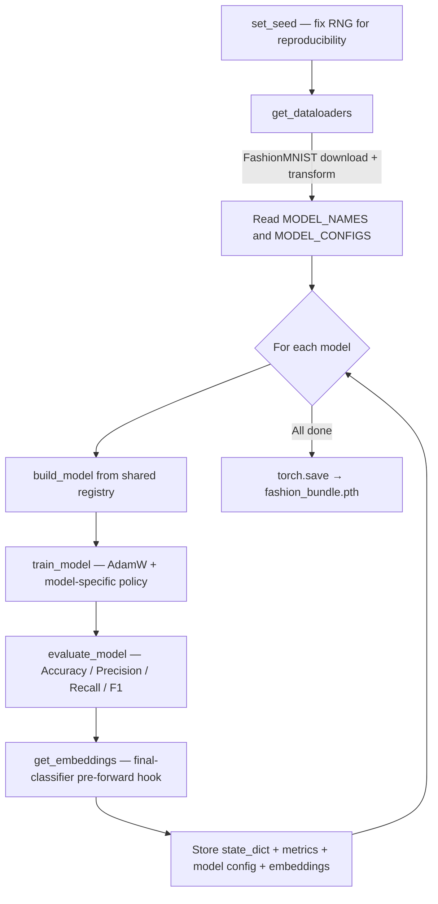
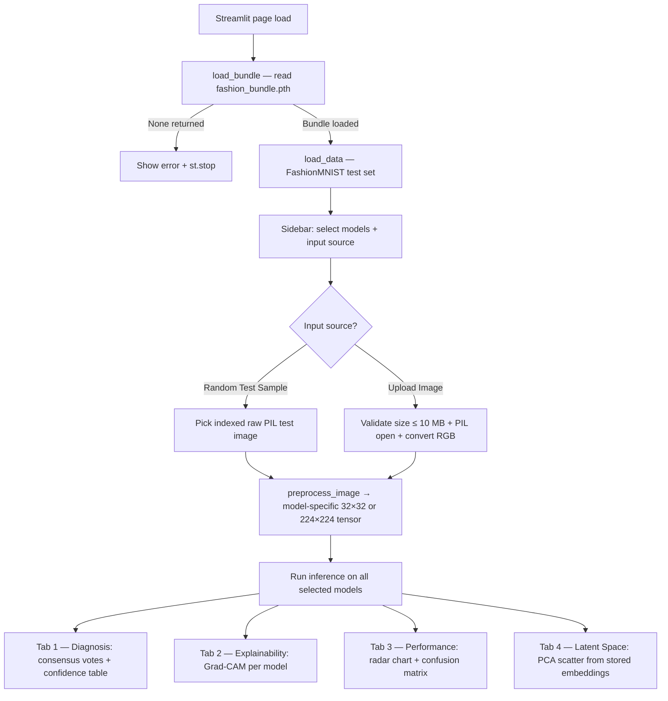

# Fashion Neural Lab

[](https://streamlit.io)


Fashion Neural Lab trains seven neural network architectures on [FashionMNIST](https://github.com/zalandoresearch/fashion-mnist). Its Streamlit dashboard compares their predictions, Grad-CAM visualizations, performance metrics, and latent-space plots.

Developer and operator reference: [Fashion Neural Lab Technical Guide](docs/TECHNICAL_GUIDE.md).

## Contents

1. [Project overview](#1-project-overview)
2. [Architecture overview](#2-architecture-overview)
3. [System flow](#3-system-flow)
4. [Data model: bundle structure](#4-data-model--bundle-structure)
5. [Core modules](#5-core-modules-breakdown)
6. [Security and input validation](#6-security--input-validation)
7. [Setup and installation](#7-setup--installation)
8. [Quickstart](#8-quickstart)
9. [Running the application](#9-running-the-application)
10. [Testing](#10-testing)
11. [Limitations](#11-limitations)
12. [Possible improvements](#12-future-improvements)

## 1. Project overview

Fashion Neural Lab trains and compares seven architectures on the 10-class FashionMNIST dataset:

| Model | Origin | Final Layer Modification |
|---|---|---|
| ResNet18 | `torchvision.models.resnet18` (ImageNet-pretrained) | `fc` → `Linear(512, 10)` |
| EfficientNet-B0 | `torchvision.models.efficientnet_b0` (ImageNet-pretrained) | Final classifier → 10 classes |
| SimpleCNN | Custom 3-layer CNN | `Linear(1024, 10)` |
| WideResNet-28-10 | Custom CIFAR-style WideResNet | `fc` → `Linear(640, 10)` |
| ConvNeXt-Tiny | `torchvision.models.convnext_tiny` (ImageNet-pretrained) | Final classifier → 10 classes |
| MobileNetV3-Large | `torchvision.models.mobilenet_v3_large` (ImageNet-pretrained) | Final classifier → 10 classes |
| EfficientNetV2-S | `torchvision.models.efficientnet_v2_s` (ImageNet-pretrained) | Final classifier → 10 classes |

The dashboard provides these features:

- Multi-model consensus combines votes for one image and reports each model's confidence.
- Grad-CAM shows the image regions each architecture uses for its prediction.
- Performance radar charts compare accuracy, precision, recall, and F1.
- Interactive confusion matrices use stored embeddings and classifier heads.
- Latent-space PCA projects the 10,000 test-set embeddings into two dimensions and colors points by class.

FashionMNIST classes:

`T-shirt/top` · `Trouser` · `Pullover` · `Dress` · `Coat` · `Sandal` · `Shirt` · `Sneaker` · `Bag` · `Ankle boot`

## 2. Architecture overview

The system consists of two entrypoints, a shared model registry, and one artifact:

```
┌──────────────────────────────┐
│      model_registry.py       │  Shared architectures + policies
└──────────────┬───────────────┘
               │
┌──────────────▼───────────────┐
│         train.py             │  Offline pipeline
│ Data → Train → Eval → Embed │
│ → Save fashion_bundle.pth   │
└──────────────┬───────────────┘
               │
        fashion_bundle.pth
               │
┌──────────────▼───────────────┐
│           app.py             │  Streamlit dashboard
│  Load bundle → Reconstruct  │
│  models → Serve 4-tab UI    │
└──────────────────────────────┘
```

| Component | File | Role |
|---|---|---|
| Training pipeline | `train.py` | Downloads FashionMNIST, trains seven models, evaluates metrics, extracts embeddings, saves bundle |
| Model registry | `model_registry.py` | Owns all architecture definitions, preprocessing, training metadata, classifier layers, and Grad-CAM targets |
| Dashboard | `app.py` | Loads bundle, reconstructs architectures, serves interactive comparison UI |
| Bundle | `fashion_bundle.pth` | Serialized dict containing state dicts, metrics, model policies, and embedding indices |
| Tests | `tests/` | 37 pytest-based unit, registry, and integration tests |

`train.py` and `app.py` both use `model_registry.py`, preventing architecture and preprocessing drift between training and inference.

## 3. System flow

### Training pipeline (`train.py`)


```mermaid
flowchart TD
    A[set_seed — fix RNG for reproducibility] --> B[get_dataloaders]
    B -->|FashionMNIST download + transform| C[Read MODEL_NAMES and MODEL_CONFIGS]
    C --> D{For each model}
    D --> D1[build_model from shared registry]
    D1 --> E[train_model — AdamW + model-specific policy]
    E --> F[evaluate_model — Accuracy / Precision / Recall / F1]
    F --> G[get_embeddings — final-classifier pre-forward hook]
    G --> H[Store state_dict + metrics + model config + embeddings]
    H --> D
    D -->|All done| I[torch.save → fashion_bundle.pth]
```

### Dashboard pipeline (`app.py`)


```mermaid
flowchart TD
    A[Streamlit page load] --> B[load_bundle — read fashion_bundle.pth]
    B -->|None returned| B1[Show error + st.stop]
    B -->|Bundle loaded| C[load_data — FashionMNIST test set]
    C --> D[Sidebar: select models + input source]
    D --> E{Input source?}
    E -->|Random Test Sample| F[Pick indexed raw PIL test image]
    E -->|Upload Image| G[Validate size ≤ 10 MB + PIL open + convert RGB]
    F --> H[preprocess_image → model-specific 32×32 or 224×224 tensor]
    G --> H
    H --> I[Run inference on all selected models]
    I --> J[Tab 1 — Diagnosis: consensus votes + confidence table]
    I --> K[Tab 2 — Explainability: Grad-CAM per model]
    I --> L[Tab 3 — Performance: radar chart + confusion matrix]
    I --> M[Tab 4 — Latent Space: PCA scatter from stored embeddings]
```

### Preprocessing transform (shared)

Both entrypoints use the transforms in `model_registry.py`:

```
32×32 models: Resize/Crop(32×32) → Grayscale(3 channels) → Normalize(ImageNet μ/σ)
224×224 models: Resize(256) → Crop(224×224) → Grayscale(3 channels) → Normalize(ImageNet μ/σ)
```

Training adds random cropping and horizontal flipping. Evaluation and dashboard inference use deterministic center crops.

<a id="4-data-model--bundle-structure"></a>

## 4. Data model: bundle structure

`fashion_bundle.pth` is a Python dict saved with `torch.save`. Its schema:

```python
{
    "bundle_version": 2,
    "models": {
        "ResNet18": OrderedDict,  # model.state_dict()
        "EfficientNet-B0": OrderedDict,
        "SimpleCNN": OrderedDict,
        # Four additional registered models...
    },
    "metrics": {
        "ResNet18": {"Accuracy": float, "Precision": float, "Recall": float, "F1": float},
        "EfficientNet-B0": {...},
        "SimpleCNN": {...},
        # Four additional registered models...
    },
    "model_config": {
        "ResNet18": {
            "input_size": 224,
            "batch_size": 16,
            "epochs": 5,
            "optimizer": "AdamW",
            "learning_rate": 0.0001,
            "weight_decay": 0.0001,
            "pretrained": True,
        },
        # Configuration for every stored model...
    },
    "search_index": {
        "ResNet18": {
            "vectors": Tensor,  # shape (N, D) — embeddings
            "labels": Tensor,  # shape (N,)   — ground-truth class indices
            "paths": list,  # list of int  — dataset indices
        },
        "EfficientNet-B0": {...},
        "SimpleCNN": {...},
    },
}
```

The bundle is loaded with `weights_only=True` in `app.py`. Legacy bundles without `model_config` remain usable with their original 32×32 preprocessing.

<a id="5-core-modules-breakdown"></a>

## 5. Core modules

### `train.py`

| Function | Purpose | Input | Output |
|---|---|---|---|
| `set_seed(seed)` | Fix Python, PyTorch, and CUDA RNG seeds; set cuDNN deterministic mode | `int` (default 42) | — |
| `get_dataloaders(input_size, batch_size)` | Download FashionMNIST and build model-appropriate training/evaluation loaders | size, batch size | `(train_loader, test_loader, test_data)` |
| `get_models(*, pretrained=True)` | Instantiate all seven registered architectures | bool | `dict[str, nn.Module]` |
| `train_model(...)` | AdamW, CrossEntropyLoss, configurable epochs/lr/weight decay, and batch validation | model, DataLoader, policy | trained `nn.Module` |
| `evaluate_model(model, test_loader)` | Inference pass → sklearn accuracy, weighted precision/recall/F1 | model, DataLoader | `dict` with 4 metric keys |
| `get_embeddings(model, loader, model_name)` | Capture the exact input to the final linear classifier with a generic pre-forward hook | model, DataLoader, str | `(Tensor, Tensor, list)` |

### `app.py`

| Function | Purpose | Input | Output |
|---|---|---|---|
| `load_bundle()` | Read `fashion_bundle.pth` with `weights_only=True`; return `None` on missing/corrupt file; set `BUNDLE_LOAD_ERROR` global | — | `dict` or `None` |
| `get_model_architecture(model_name)` | Reconstruct architecture without weights; raise `ValueError` for unknown names | `str` | `nn.Module` |
| `load_active_models(selected, bundle_models)` | Load state dicts into reconstructed architectures, move to device, set eval mode; raise `KeyError` if model absent from bundle | `list[str]`, `dict` | `dict[str, nn.Module]` |
| `preprocess_image(image, model_name, model_config)` | Apply the stored model resolution, normalize, add batch dimension, and move to device | image, model name, config | `Tensor (1,3,H,W)` |
| `get_gradcam(model, model_name, input_tensor, target_class_idx)` | Build `GradCAM` with architecture-specific target layer; raise `ValueError` for unknown names | model, str, Tensor, int | `np.ndarray (H,W)` |

### `SimpleCNN` (defined in `model_registry.py`)

```
Conv2d(3→32, 3×3) → ReLU → MaxPool2d(2)
Conv2d(32→64, 3×3) → ReLU → MaxPool2d(2)
Conv2d(64→64, 3×3) → ReLU → MaxPool2d(2)
Flatten(64×4×4 = 1024)
Linear(1024 → 10)
```

`get_embedding()` returns the 1024-d flattened feature vector before the classifier.

<a id="6-security--input-validation"></a>

## 6. Security and input validation

The following protections are implemented in code. No additional security layers exist.

| Protection | Location | Behavior |
|---|---|---|
| Bundle load safety | `app.py` `load_bundle()` | `torch.load(weights_only=True)` rejects arbitrary pickle payloads |
| Missing/corrupt bundle | `app.py` `load_bundle()` | Returns `None`; dashboard shows error and calls `st.stop()` |
| Unknown model name | `app.py` `get_model_architecture()`, `get_gradcam()` | Raises `ValueError` |
| Missing model key in bundle | `app.py` `load_active_models()` | Raises `KeyError` |
| Upload file size limit | `app.py` upload handler | Rejects files > 10 MB |
| Invalid upload format | `app.py` upload handler | Catches `UnidentifiedImageError` and `OSError` |
| Training batch validation | `train.py` `train_model()` | Validates tensor rank (4 for images, 1 for labels), batch-size match, and type (catches `TypeError`/`AttributeError` from non-tensor data) |
| Unsupported embedding model | `train.py` `get_embeddings()` | Raises `ValueError` for names outside the seven-model registry |

The dashboard has no rate limiting, authentication, CSRF protection, or output sanitization. It is intended for local or trusted-network use.

<a id="7-setup--installation"></a>

## 7. Setup and installation

### Prerequisites

- Python 3.11+
- [uv](https://docs.astral.sh/uv/)
- Internet connection on first run (to download FashionMNIST and weights for ResNet18, EfficientNet-B0, ConvNeXt-Tiny, MobileNetV3-Large, and EfficientNetV2-S)
- CUDA GPU optional (the code auto-detects via `torch.cuda.is_available()` and falls back to CPU)

### Create environment and install

```bash
uv sync --all-groups
```

Runtime dependencies live in `pyproject.toml`; development tooling is in its `dev` dependency group. The resolved versions are committed in `uv.lock`.

`torch` and `torchvision` are resolved from the official PyTorch CUDA 13.0 index configured in `pyproject.toml`.

| Package | Used by |
|---|---|
| `torch`, `torchvision` | Model training, pretrained backbones, transforms, FashionMNIST |
| `streamlit` | Dashboard UI |
| `grad-cam` | Grad-CAM heatmap generation |
| `scikit-learn` | Accuracy, precision, recall, F1, PCA, confusion matrix |
| `plotly` | Radar charts, confusion matrix heatmaps, PCA scatter |
| `pandas` | DataFrame display in Streamlit tables |
| `opencv-python-headless` | Grad-CAM overlay resizing |
| `numpy`, `pillow` | Array/image manipulation |
| `tqdm` | Training progress bars |

## 8. Quickstart

```bash
# 1. Clone and enter
git clone https://github.com/pypi-ahmad/Fashion-Class-Classification.git
cd Fashion-Class-Classification

# 2. Install (creates .venv)
uv sync --all-groups

# 3. Train (downloads data + pretrained weights on first run)
uv run python train.py

# 4. Launch dashboard
uv run streamlit run app.py

# 5. (Optional) Run tests
uv run pytest -q
```

## 9. Running the application

### Training (`train.py`)

```bash
uv run python train.py
```

Execution:
1. Seeds RNG (`random`, `torch`, CUDA) with seed 42.
2. Downloads FashionMNIST to `./data/` (60 000 train / 10 000 test).
3. Trains scratch models for 20 epochs at 32×32 and fine-tunes pretrained models for 5 epochs at 224×224 using AdamW.
4. Saves `fashion_bundle.pth` in the project root.

Output: progress bars via `tqdm`, per-model metrics printed to stdout, final bundle file.

### Dashboard (`app.py`)

```bash
uv run streamlit run app.py
```

The browser opens at `http://localhost:8501` with:

- The sidebar has a model selector, with all models enabled by default, and an input-source toggle.
- Diagnosis & Consensus shows the input image, known ground truth, per-model predictions and confidence, and majority vote.
- Explainability overlays a Grad-CAM heatmap for each selected model.
- Performance contains a radar chart for the four metrics and a selectable confusion matrix.
- Latent Space projects the primary model's 10,000 test-set embeddings with PCA and colors them by class.

Input options:
- Random Test Sample draws from the FashionMNIST test set. The shuffle button selects another sample.
- Upload Image accepts `.jpg`, `.png`, and `.jpeg` files up to 10 MB.

## 10. Testing

Framework: pytest

```bash
uv run pytest -v
```

The test suite contains 37 tests across 4 files:

| File | Tests | Scope |
|---|---|---|
| `tests/test_app_unit.py` | 12 | Model-aware preprocessing, bundle loading, architecture reconstruction, model loading, and Grad-CAM |
| `tests/test_train_unit.py` | 8 | `SimpleCNN` shapes, data loading, training, evaluation, generic classifier-input embeddings, unknown models, and invalid batches |
| `tests/test_integration.py` | 5 | Stubbed seven-model training, inference pipelines, and bundle roundtrip |
| `tests/test_model_registry.py` | 12 | Real no-download construction and forward passes for all models, transforms, metadata, and WideResNet validation |

Application helper tests use Streamlit, Grad-CAM, and dataset stubs. Registry tests construct the real architectures with pretrained weights disabled, so tests require no model downloads.

## 11. Limitations

- The Streamlit dashboard has no authentication and is intended for local use.
- Model policies are fixed in the registry and have no CLI overrides.
- Scratch models train for 20 epochs while pretrained models fine-tune for 5. The dashboard therefore compares practical accuracy under different training budgets.
- Training uses one device and does not support distributed or multi-GPU execution.
- Tab 3 runs the classifier head on stored embeddings instead of performing full forward passes. Its confusion matrix depends on embeddings that match the current classifier input.
- The test suite covers helpers and training logic but does not render the Streamlit interface.

<a id="12-future-improvements"></a>

## 12. Possible improvements

- Expose epochs, learning rate, batch size, and seed through CLI arguments or a config file.
- Tune augmentation and learning rates from validation results instead of fixed defaults.
- Add browser tests with Playwright or Streamlit's `AppTest` for rendering and interaction paths.

## License

This project is released under the [MIT License](LICENSE).

<p align="center">Ahmad Mujtaba</p>
