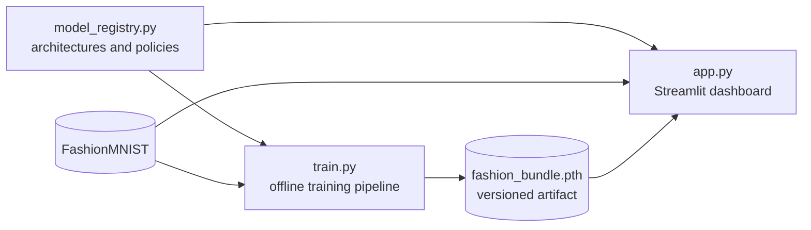
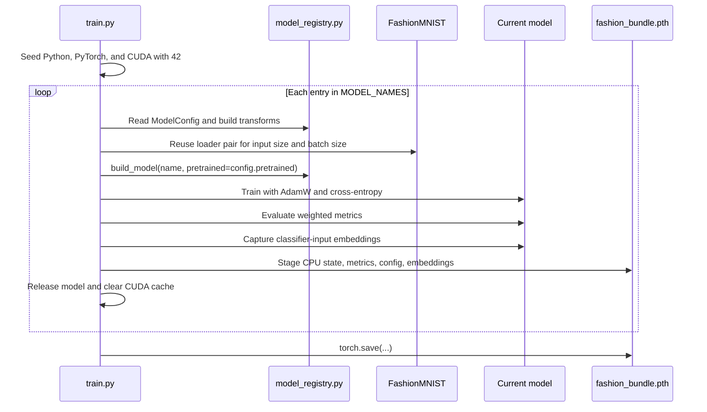

# Fashion Neural Lab technical guide

This developer and operator guide covers the architecture, data contracts, extension points, and
operational procedures. Installation and dashboard instructions are in the
[project README](../README.md).

## Audience and scope

Use this guide when you need to:

- understand how training output becomes an interactive dashboard;
- inspect model, transform, or bundle contracts;
- add another image-classification architecture;
- regenerate and validate `fashion_bundle.pth`;
- diagnose model loading, inference, or Grad-CAM failures.

The project is a local, single-process application. It does not expose an HTTP API, distributed
training interface, authentication layer, or model-serving endpoint.

## System architecture



| Component | Responsibility | Important boundary |
|---|---|---|
| `model_registry.py` | Owns architectures, training policies, transforms, classifier layers, and Grad-CAM targets | Training and inference must use the same registry |
| `train.py` | Downloads data, trains and evaluates each model, extracts embeddings, and writes the bundle | Runs only when invoked as a script |
| `app.py` | Loads the bundle, reconstructs selected models, performs inference, and renders four analysis tabs | Reads artifacts; it does not train models |
| `fashion_bundle.pth` | Carries state dictionaries, metrics, embeddings, labels, indices, and training metadata | Version 2 is generated by the current trainer |

### Architectural invariants

1. Every registered model produces ten logits in FashionMNIST class order.
2. Every model exposes a final `nn.Linear` classifier through `get_classifier_layer()`.
3. Stored embeddings are the exact inputs received by that final linear layer in evaluation mode.
4. Training and dashboard preprocessing resolve through `build_transform()`.
5. A model name is a persistent bundle key. Renaming it breaks state lookup unless the bundle is
   regenerated or migrated.
6. State dictionaries are copied to CPU before serialization so the bundle is device-independent.

## Model registry reference

`MODEL_CONFIGS` defines the seven supported models.

| Bundle key | Origin | Input | Batch | Epochs | Learning rate | Pretrained |
|---|---|---:|---:|---:|---:|---|
| `ResNet18` | torchvision | 224 | 16 | 5 | `1e-4` | Yes |
| `EfficientNet-B0` | torchvision | 224 | 16 | 5 | `1e-4` | Yes |
| `SimpleCNN` | Local | 32 | 64 | 20 | `1e-3` | No |
| `WideResNet-28-10` | Local | 32 | 64 | 20 | `1e-3` | No |
| `ConvNeXt-Tiny` | torchvision | 224 | 16 | 5 | `1e-4` | Yes |
| `MobileNetV3-Large` | torchvision | 224 | 16 | 5 | `1e-4` | Yes |
| `EfficientNetV2-S` | torchvision | 224 | 16 | 5 | `1e-4` | Yes |

All models use AdamW with weight decay `1e-4` and cross-entropy loss. Pretrained models replace
their final classifier with a ten-output linear layer. `SimpleCNN` and `WideResNet-28-10` are
initialized locally.

### Transform policies

FashionMNIST images are grayscale. Every transform expands them to three channels and applies
ImageNet normalization:

```text
mean = [0.485, 0.456, 0.406]
std  = [0.229, 0.224, 0.225]
```

| Input size | Training transform | Evaluation and dashboard transform |
|---|---|---|
| 32 | Resize 32×32, padded random crop, random horizontal flip | Resize 32×32 |
| 224 | Resize shorter edge to 256, random 224 crop, random horizontal flip | Resize to 256, center crop 224 |

`build_transform()` rejects sizes other than 32 and 224 with `ValueError`.

## Training lifecycle

Run the complete pipeline from the repository root:

```powershell
uv sync --all-groups
uv run python train.py
```

The script performs this sequence:



The loader cache is keyed by `(input_size, batch_size)`. Models with the same policy reuse the
same dataset and loader objects. Models are trained one at a time, and their serialized weights
are cloned to CPU before the next model begins.

### Evaluation metrics

`evaluate_model()` returns:

```python
{
    "Accuracy": float,
    "Precision": float,
    "Recall": float,
    "F1": float,
}
```

Precision, recall, and F1 use scikit-learn's weighted average with `zero_division=0`.

### Embedding contract

`get_embeddings()` registers a pre-forward hook on the model's final linear classifier. For each
test batch it:

1. runs a normal evaluation forward pass;
2. captures the tensor passed into the final classifier;
3. flattens and moves that tensor to CPU;
4. stores corresponding labels and sequential dataset indices.

The dashboard reconstructs logits as `classifier(vectors)` for every model, which removes the need
for architecture-specific confusion-matrix branches.

## Bundle format

The current trainer writes bundle version 2:

```python
{
    "bundle_version": 2,
    "models": {
        model_name: state_dict,
    },
    "metrics": {
        model_name: {
            "Accuracy": float,
            "Precision": float,
            "Recall": float,
            "F1": float,
        },
    },
    "search_index": {
        model_name: {
            "vectors": Tensor,  # [test_samples, embedding_dimension], stored on CPU
            "labels": Tensor,  # [test_samples], stored on CPU
            "paths": list[int],  # sequential FashionMNIST dataset indices
        },
    },
    "model_config": {
        model_name: {
            "input_size": int,
            "batch_size": int,
            "epochs": int,
            "optimizer": "AdamW",
            "learning_rate": float,
            "weight_decay": float,
            "pretrained": bool,
        },
    },
}
```

The dashboard loads the artifact using `torch.load(..., weights_only=True)` and maps tensors to
the active device.

### Legacy compatibility

Older bundles may omit `bundle_version` and `model_config`. The dashboard treats every model in
such a bundle as a 32×32 model, matching the preprocessing used before version 2. A legacy bundle
contains only the models stored when it was created; adding registry entries does not inject new
weights into an existing artifact.

Regenerate the bundle after changing any architecture, classifier shape, model name, or transform
policy.

## Dashboard runtime

Start Streamlit from the repository root:

```powershell
uv run streamlit run app.py
```

At startup, the app:

1. loads `fashion_bundle.pth` from the current working directory;
2. downloads or opens the raw FashionMNIST test split;
3. lists the models present in `bundle["models"]`;
4. reconstructs selected architectures without pretrained downloads;
5. loads their stored state dictionaries and switches them to evaluation mode.

For each selected model, the input image is transformed at that model's recorded resolution. The
dashboard then derives softmax probabilities, the predicted class, confidence, and the complete
ten-class probability vector.

| Tab | Data path |
|---|---|
| Diagnosis & Consensus | Live logits from each selected model |
| Explainability | Live gradients through the registry-selected Grad-CAM layer |
| Performance | Stored metrics and classifier logits reconstructed from stored embeddings |
| Latent Space | PCA fitted on the primary model's stored test embeddings |

Uploaded files are limited to JPEG or PNG images of at most 10 MB. Invalid images are rejected by
Pillow before inference.

## Internal API reference

These functions are internal Python interfaces. There is no compatibility guarantee beyond the
bundle contract and the tests that exercise them.

### `model_registry.py`

| Interface | Returns | Failure behavior |
|---|---|---|
| `build_transform(input_size, *, train)` | torchvision transform pipeline | `ValueError` for unsupported size |
| `build_model(model_name, *, pretrained)` | Ten-class `nn.Module` | `ValueError` for unknown model name |
| `get_classifier_layer(model, model_name)` | Final `nn.Linear` | `ValueError` for unknown name; `TypeError` if the registered head is not linear |
| `get_gradcam_layer(model, model_name)` | Architecture-specific spatial feature module | `ValueError` for unknown name |
| `serialize_model_config(config)` | Primitive dictionary safe for bundle serialization | No custom validation |

`WideResNet` accepts `depth`, `widen_factor`, and `dropout`. Its depth must satisfy
`(depth - 4) % 6 == 0`; invalid values raise `ValueError`.

### `train.py`

| Interface | Purpose | Important behavior |
|---|---|---|
| `set_seed(seed=42)` | Configure deterministic Python/PyTorch state | Disables cuDNN benchmarking |
| `get_dataloaders(input_size=32, batch_size=None)` | Create training/test loaders and return the test dataset | Defaults to batch 64 at 32px and 16 otherwise |
| `get_models(*, pretrained=True)` | Build all registered models | Scratch-only models never request pretrained weights |
| `train_model(...)` | Optimize one model | Validates image rank, label rank, and matching batch sizes |
| `evaluate_model(model, test_loader)` | Calculate four classification metrics | Runs in evaluation mode without gradients |
| `get_embeddings(model, loader, model_name)` | Return vectors, labels, and dataset indices | Rejects names outside `MODEL_NAMES` |

Invalid batch objects, tensor ranks, or mismatched image/label counts cause `train_model()` to
raise `ValueError` before optimizer work continues.

### `app.py`

| Interface | Purpose | Failure behavior |
|---|---|---|
| `load_data()` | Load the raw FashionMNIST test split | Dataset/download exceptions propagate |
| `load_bundle()` | Load the configured bundle with safe tensor-only loading | Returns `None` and records `BUNDLE_LOAD_ERROR` on failure |
| `get_model_architecture(model_name)` | Rebuild an architecture without downloaded weights | Registry `ValueError` for unknown names |
| `load_active_models(selected, bundle_models)` | Restore selected state dictionaries | `KeyError` for absent bundle entry; `RuntimeError` for incompatible state |
| `preprocess_image(image, model_name, model_config=None)` | Build a batched device tensor at the selected resolution | `KeyError` for an unknown name; transform/image conversion errors propagate |
| `get_gradcam(model, model_name, input_tensor, target_class_idx)` | Produce one grayscale activation map | Registry or Grad-CAM errors propagate to the tab handler |

## Add a model

A new model must be wired into the full registry:

1. Add a stable bundle key and `ModelConfig` to `MODEL_CONFIGS`.
2. Extend `build_model()` and replace the model's classifier with an `nn.Linear` producing ten
   logits.
3. Extend `get_classifier_layer()` so embeddings can be captured and replayed.
4. Extend `get_gradcam_layer()` with a spatial feature layer that emits an image-like feature map.
5. Use either 32 or 224 input pixels, or deliberately extend and test `build_transform()`.
6. Add registry tests for construction, output shape, embedding reconstruction, and Grad-CAM
   target selection.
7. Regenerate `fashion_bundle.pth`; an old artifact cannot supply weights for the new key.
8. Update the model table and bundle documentation.

Before a full training run, validate the implementation without downloading pretrained weights:

```powershell
uv run pytest -q tests/test_model_registry.py
uv run ruff check .
uv run ty check .
```

## Operations and troubleshooting

### Standard verification

```powershell
uv lock --check
uv sync --all-groups --check
uv run ruff format --check .
uv run ruff check .
uv run ty check .
uv run python -m compileall -q app.py model_registry.py train.py tests
uv run pytest -q
```

### Failure guide

| Symptom | Likely cause | Action |
|---|---|---|
| Dashboard reports `File not found: fashion_bundle.pth` | Training has not produced an artifact in the current directory | Run `uv run python train.py` from the repository root |
| Dashboard reports a bundle load error | Truncated, corrupt, or incompatible artifact | Regenerate the bundle; preserve the failing file if it is needed for diagnosis |
| `Missing key(s)` or `Unexpected key(s)` while loading a model | Architecture code and stored state dictionary no longer match | Use matching code or regenerate the bundle with the current registry |
| Only three models appear | A legacy three-model bundle is loaded | Regenerate the version-2 bundle |
| CUDA out-of-memory during training | Selected batch size exceeds available device memory | Lower that model's registry batch size, document the new policy, and regenerate the bundle |
| First run fails while downloading | FashionMNIST or pretrained weights are unavailable | Restore network access and rerun; scratch models do not need backbone downloads |
| `Unsupported input size` | A registry entry requests a size other than 32 or 224 | Add a tested transform policy or correct the registry entry |
| Grad-CAM tab shows an error for a new model | Target layer is missing or does not expose a spatial feature tensor | Correct `get_gradcam_layer()` and add a Grad-CAM helper test |
| Confusion matrix reconstruction fails | Stored vectors do not match the current final classifier input | Regenerate embeddings and the bundle with matching code |

## Security and operational boundaries

- The dashboard is intended for local or trusted-network use and has no authentication or rate
  limiting.
- Bundle loading uses `weights_only=True`; keep that restriction when changing artifact handling.
- Uploaded files are decoded in memory and are not persisted by the application.
- The training pipeline downloads third-party datasets and pretrained weights on first use.
- Embedded model metrics describe the specific training run in the bundle; they are not guaranteed
  by the architecture definitions.

See [SECURITY.md](../SECURITY.md) for vulnerability reporting.

## Verification status

The current automated suite verifies model construction without pretrained downloads, output
shapes, classifier-input reconstruction, transforms, training helpers, bundle round trips, legacy
resolution fallback, and selected inference paths. The latest recorded result is in
[TEST_REPORT.md](../TEST_REPORT.md).

The full seven-model GPU training run, regenerated version-2 bundle, and browser-level Streamlit
rendering have not been verified in the current worktree.
